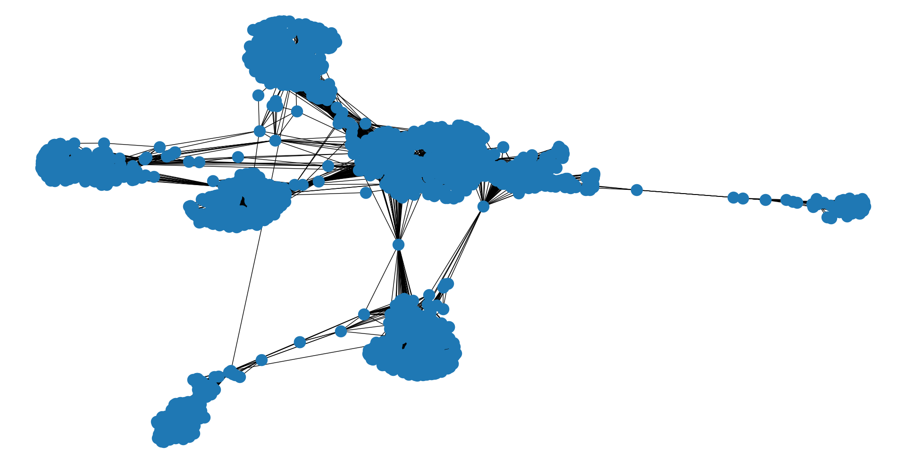
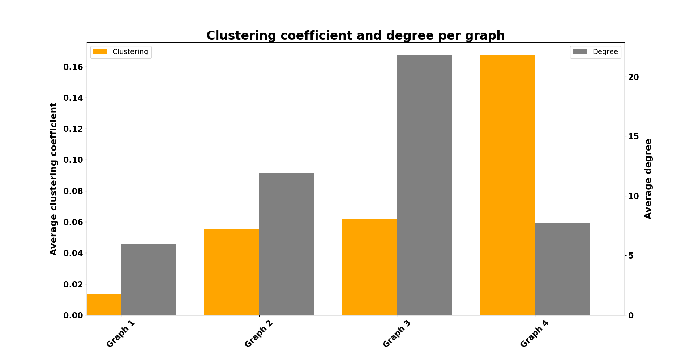

# Independent Cascade Model implementation using NetworkX library

This project has two main goals: 
* Analysis and assessment based on closeness, clustering, coefficient, betweeness and degree (facebook graph).
* Examine information diffusion based on the Independent Cascade Model.

### General info:
* Language: Python
* Main library: NetworkX

## "ego-Facebook" graph

*A graph created based on "ego-Facebook" [dataset](https://snap.stanford.edu/data/ego-Facebook.html)*

## Clustering coefficient and degree per graph

